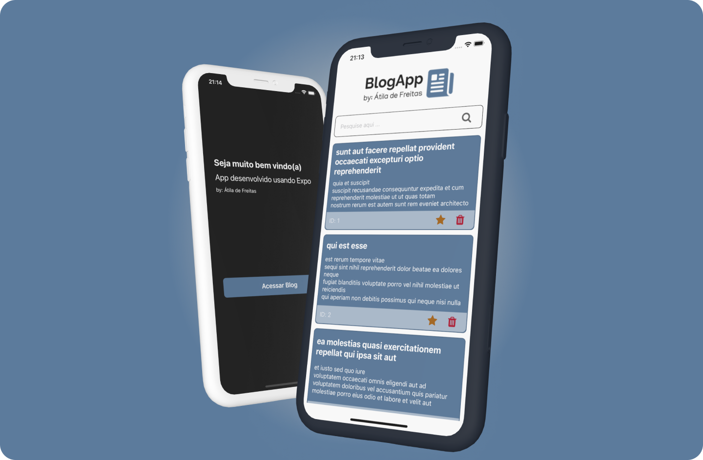
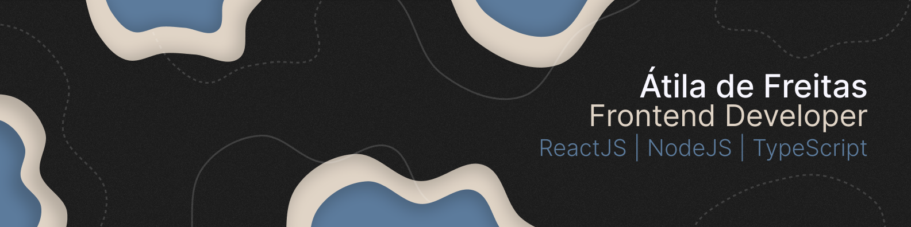

<div id="top"></div>

<br />
<div align="center">
  <a href="https://github.com/othneildrew/Best-README-Template">
    
  </a>
  <h3 align="center">Blog App</h3>

  <p align="center">
    An awesome React Native project: by Átila de Freitas
    <br />
  </p>
</div>

<details>
  <summary>Table of Contents</summary>
  <ol>
    <li>
      <a href="#about-the-project">About The Project</a>
      <ul>
        <li><a href="#built-with">Built With</a></li>
      </ul>
    </li>
    <li>
      <a href="#getting-started">Getting Started</a>
      <ul>
        <li><a href="#prerequisites">Prerequisites</a></li>
        <li><a href="#installation">Installation</a></li>
      </ul>
    </li>
    <li><a href="#usage-&-Function-walkthrough">Usage</a></li>
    <li><a href="#contact">Contact</a></li>
  </ol>
</details>

## About The Project

<div align="center">

</div>
</br>
Application developed in React Native focusing on the use of the Styled Components library to create visual components, as well as consume external API and add new functionality with state manipulation.

The application was build in Expo CLI for some reasons. The fast enviroment building and setting up is one of them.

In this application you can:

- Search for a specific title or post's body content;
- Delete a post;
- Favorite a post;

<p align="right">(<a href="#top">back to top</a>)</p>

### Built With

- [React Native](https://reactnative.dev/)
- [Expo CLI](https://docs.expo.dev/workflow/expo-cli/)
- [Styled Components](https://styled-components.com/)

<p align="right">(<a href="#top">back to top</a>)</p>

## Getting Started

### Prerequisites

For run the application you need the following tools:

- npm
  ```sh
  npm install npm@latest -g
  ```
- Expo
  ```sh
  npm install -g expo-cli
  ```

### Installation

1. Clone the repo

```sh
git clone https://github.com/atiladefreitas/blog-rn.git
```

2. Install NPM packages
   ```sh
   npm install
   ```
   or
   ```sh
   yarn install
   ```

<p align="right">(<a href="#top">back to top</a>)</p>

## Usage & Function walkthrough

This application was developed for study and contains some simple features of interaction with the API.

- Fetching data from API

_For this, useEffect Hook was used and an new state was created in `newPosts`, working like an local storage_

```javascript
useEffect(() => {
  const fetchPosts = () => {
    fetch(`${apiURL}/posts`)
      .then((response) => response.json())
      .then((json) => {
        const newPosts = [
          ...json.map((post: any) => {
            return {
              id: post.id,
              body: post.body,
              title: post.title,
              userId: post.userId,
              favorite: false,
            };
          }),
        ];
        setOriginalData(newPosts);
        setPosts(newPosts);
      });
  };
  fetchPosts();
}, []);
```

- Deleting Post

_The API being consumed is an Fake API, so, all `DELETE` requisition will return `error 200`, for handle with this, I created an simple `if else` statement for deleted the specific post localy_

```javascript
const handleDeletePost = async (id: any) => {
  await fetch(`${apiURL}/posts/${id}`, {
    method: "DELETE",
  })
    .then((response) => {
      if (response.status !== 200) {
        return;
      } else {
        setPosts(
          posts.filter((post) => {
            return post.id !== id;
          })
        );
      }
    })
    .catch((error) => {
      console.log(error.message);
    });
};
```

<p align="right">(<a href="#top">back to top</a>)</p>

## Contact

<div align="center">


</br>
</br>
<p align="center">
<a href="https://www.linkedin.com/in/atilafreitas/"></a>
    &nbsp;
    <a href="https://instagram.com/atiladefreitas.co/"></a>
    &nbsp;
    <a href="https://t.me/atilajcfreitas"></a>
    &nbsp;
    <a href="mailto:contact@atiladefreitas.co"></a>
    &nbsp;
    <a href="https://github.com/atiladefreitas"></a>
</p>
</div>
